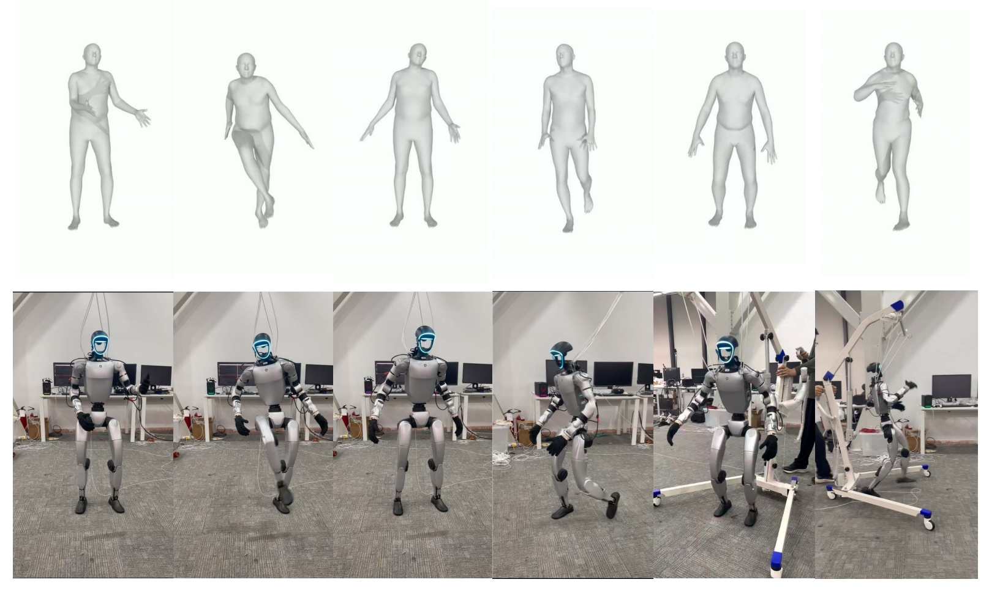

# IKMR
Implement of Implicit Kinodynamic Motion Retargeting for Human-to-humanoid Imitation Learning

Our Performance shown on project page: https://cybercal.github.io/webpage.ikmr/

Paper Link: https://arxiv.org/pdf/2509.15443


## Overview 
A lightweight neural retargeting method from human to humanoid motion through style transfer,
It is skeletal-topology based and supports large-scale and stream motion retargeting.


## Structure
```
IKMR/
├── posebox/                    ← motion data proc
├── poselib/                    ← motion pose lib
├── retargeting/
│   ├── train_cmp.py            ← pre-train script
│   └── finetune_cmp.py         ← fine-tuning script
└── readme.md
```
Here, `/retargeting/datasets/CMP` only releases 10 processed motion sequence for SMPL-G1 pairs.
We suggest 2000+ motion can obtain a stable and good retargeting quality.
More motion pairs will achieve better performance.

## Quick Start
```bash
# simple env setup
conda create -y -n ikmr python=3.10
conda activate ikmr
pip install numpy==1.21
pip install scipy==1.7.3
pip install matplotlib==3.5
pip install setuptools==59.5.0
pip3 install torch torchvision torchaudio --index-url https://download.pytorch.org/whl/cu121
pip install tensorboard

## install poselib
cd poselib
pip install -e .

## train both smpl and g1's encoder and decoder
cd retargeting
python train_cmp.py --save_dir=./exp/pretrain

## fine tuning decoder
python finetune_cmp.py --save_dir=./exp/finetune

## check whether converge
tensorboard --logdir=./retargeting/exp/your_exp/logs

## inference retargeting stream
python test_cmp.py
```
Training trick: The forward kinematics for end-effector calculation is time-cost, you can comment out this part at beginning, then apply them later.

## Acknowledgments
We would like to acknowledge the following projects from which parts of the code in this repo are derived from:
- DeepMotionEditing: https://github.com/DeepMotionEditing
- Poselib: https://github.com/ZhengyiLuo/PHC/blob/master/poselib